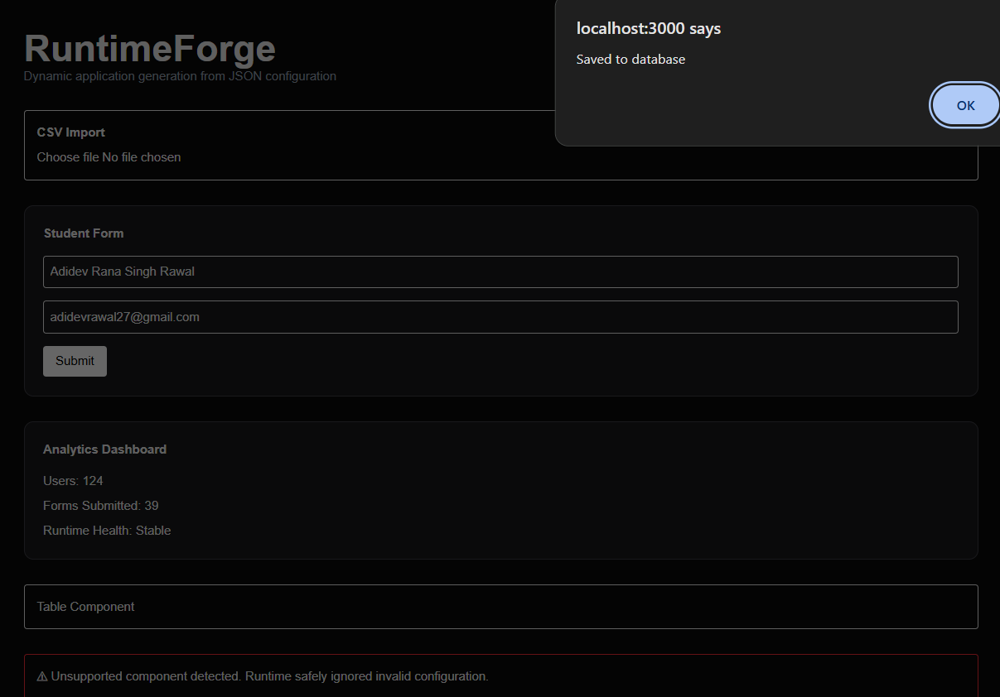
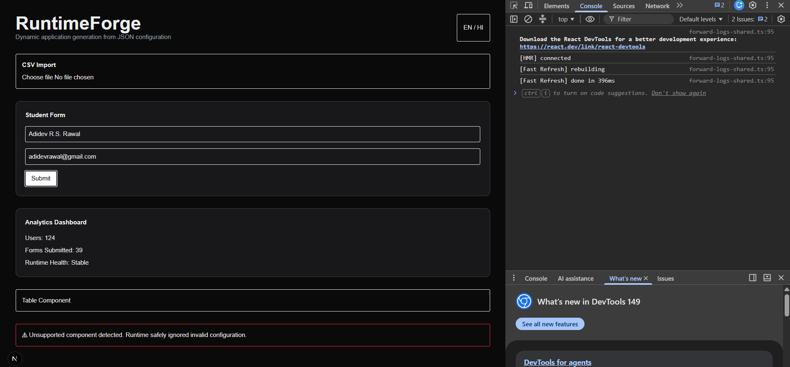

# RuntimeForge

Dynamic application generation platform powered by JSON configurations.

## Features

- Dynamic Form Rendering
- Runtime Component Registry
- CSV Import
- Analytics Dashboard
- Validation Engine
- Safe Fallback Handling

## Architecture

Frontend → Runtime Engine → API Layer → Prisma → SQLite

## Screenshots

### Analytics Dashboard

### Dynamic Form Rendering

## Demo Video

https://youtu.be/e43u81u8_5o

## Getting Started

npm install
npm run dev

## Roadmap

- AI Form Generator
- Drag & Drop Builder
- Multi-tenant Runtime
- PostgreSQL Support